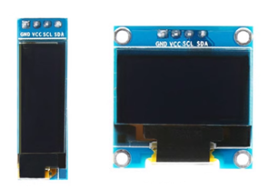

## 常用接口线序

> [!TIP]
>
> **注意！**
>
> GH1.25**立贴和卧贴座子焊盘相同，插头线序相反**，需要特别注意。通常卧贴焊盘线序标号相同，立贴相反
>
> 以下所有定义**基于线的接头**，**接头最左边的为****Pin1**，如图：
>
> 
>
> 

## 自研规范

### PCB设计规范

1. 无特殊情况，必须使用**DJI C****板线序**，如下：

   1. UART必须使用GH1.25 4Pin (RXD, TXD, GND, 5V)
   2. CAN必须使用GH1.25 2Pin (CAN_L, CAN_H)
   3. SWD必须使用MX1.25 4Pin (DIO, CLK, GND, VCC)

2. GH1.25立贴和卧贴**焊盘相同，引脚标号顺序相反**

   设计PCB必须丝印标注是**立贴**`verticle`还是**卧贴**`horizontal`

2. 建议设计 PCB 时在所有接口标注 Pinout（正面背面均可）
3. 如必须使用**自定义接口**，**必须在** **PCB** **上用丝印标注线序**

### 双头线线序

1. 对于所有**两头都是同一接口**的**双头线**，请将两头的Pin1相连

   

2. 对于所有**UART**线，要求**TX-RX交叉接线**

### DJI C板

| 接口  | 规格        | 线序                                     |
| ----- | ----------- | ---------------------------------------- |
| UART1 | GH1.25 4Pin | RXD / TXD / GND / 5V                     |
| UART2 | GH1.25 3Pin | GND / TXD / RXD                          |
| CAN1  | GH1.25 2Pin | CAN_L(黑) / CAN_H(红)                    |
| CAN2  | GH1.25 4Pin | 5V(红) / GND(灰) / CAN_H(灰) / CAN_L(灰) |
| SWD   | MX1.25 4Pin | SWDIO / SWCLK / GND / VCC                |

**接口名称对应关系**

> 软壳上标注的名称 对应 软件框架内外设名称  参考开发板原理图  

- CAN
  - CAN1->`hcan1`
  - CAN2->`hcan2`

- UART
  - UART1->`huart6`
  - UART2->`huart1`

### DJI A板

> [!TIP]
>
> 以下接口和C板相同
>
> - UART (1.25 4Pin)
>
> - CAN (GH1.25 2Pin)
>
> - SWD (1.25 4Pin)

| 接口 | 规格              | 线序                       |
| ---- | ----------------- | -------------------------- |
| UART | GH1.25 4Pin[黄标] | 悬空 / RXD / TXD / GNDGH   |
| CAN  | GH1.25 4Pin[黄标] | 悬空 / CAN_L / CAN_H / GND |

## 其他设备

### ESP32烧录/调试

| 接口 | 规格        | 线序                     |
| ---- | ----------- | ------------------------ |
| UART | GH1.25 4Pin | 5V/VCC / TXD / RXD / GND |

### I2C

主要用于SSD1306 I2C OLED屏幕

| 接口     | 规格 | 线序                  |
| -------- | ---- | --------------------- |
| 2.54排母 | 4Pin | GND / VCC / SCL / SDA |

### 舵机

| 接口 | 规格 | 线序            |
| ---- | ---- | --------------- |
|      | 3pin | PWM / VCC / GND |

> [!NOTE]
>
> 1. 目前实验室常用舵机均为5V供电，以后可能会增加其它电压的舵机
>
> 非5V舵机接口需要标明电压
>
> 2. 舵机线PWM一侧有突起，布板时需要在**PWM****引脚外侧预留空间**
>
> 焊接时PWM引脚建议选择**黄色的排针**